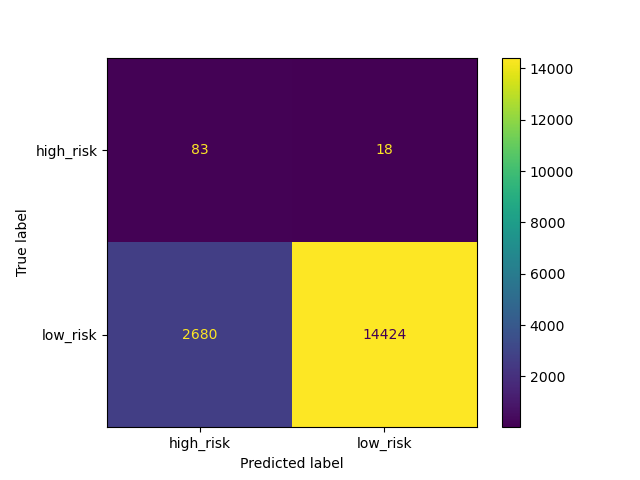
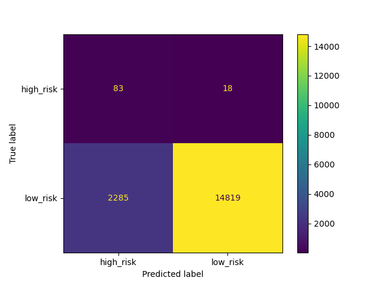
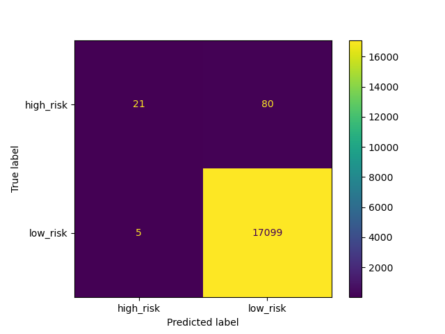

# Credit Risk Analysis

## Overview 

Supervised Machine Learning:

  - Employ different techniques to train and evaluate models with unbalanced classes.
  - Use imbalanced-learn and scikit-learn libraries to build and evaluate models using resampling.
  - Oversample the data using the RandomOverSampler and SMOTE algorithms.
  - Undersample the data using the ClusterCentroids algorithm.
  - Use a combinatorial approach of over- and undersampling using the SMOTEENN algorithm.
  - Compare two new machine learning models that reduce bias, BalancedRandomForestClassifier and EasyEnsembleClassifier, to predict credit risk. 
  - Evaluate the performance of the models.
  
## Results:

### Oversampling

### SMOTE Oversampling

### Undersampling(Cluster Centroids)

### Combination (Over and Under) Sampling (SMOTEEN)

### Easy Ensemble AdaBooster Classifier

## Summary
